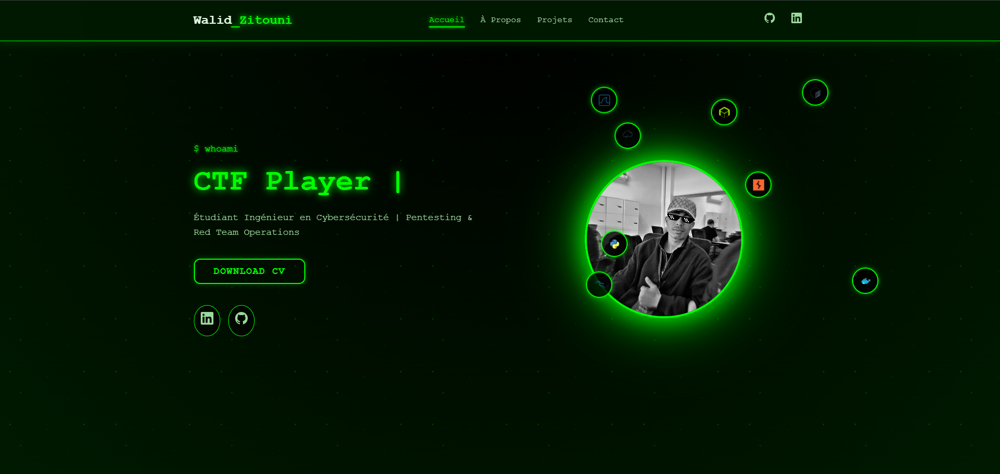

# 🔐 Portfolio Cybersécurité - Walid Zitouni

Portfolio personnel moderne avec thème cybersécurité Matrix, conçu pour présenter mes compétences, projets et expériences dans le domaine de la cybersécurité offensive.


---

## 🎯 Aperçu



Ce portfolio présente un design cyberpunk/Matrix avec :
- 🌟 Animation de typing dynamique
- 🎨 Effets de glow néon verts
- 🔄 Icônes en orbite animées autour du profil
- 📱 Design 100% responsive
- ⚡ Animations fluides au scroll
- 🎭 Thème sombre avec effets lumineux

**🔗 Demo Live :** [Voir le site](#)

---

## ✨ Fonctionnalités

### 🏠 Page d'Accueil (Hero Section)
- Animation de texte "typing" avec rotation de titres
- Photo de profil au centre avec effet de glow pulsant
- 8 icônes de technologies en orbite animée
- Boutons d'action avec effets hover
- Liens sociaux (GitHub, LinkedIn)

### 👤 Section À Propos
- Présentation personnelle
- Grille de compétences techniques interactives
- Animation de code en temps réel
- Tags de technologies avec effets hover

### 💼 Section Projets
- Cards de projets avec effets 3D
- Technologies utilisées pour chaque projet
- Effet hover avec élévation et glow
- Layout responsive en grille

### 📧 Section Contact
- Formulaire de contact fonctionnel
- Informations de contact
- Liens vers réseaux sociaux
- Validation côté client

### 🎨 Design & Animations
- **Thème Matrix/Cyberpunk** : Vert néon sur fond noir
- **Background animé** : Particules en mouvement (effet "pluie de code")
- **Orbites animées** : Logos de technologies tournant autour du profil
- **Smooth scrolling** : Navigation fluide entre sections
- **Intersection Observer** : Animations au défilement
- **Responsive** : Adaptation mobile, tablette, desktop

---

## 🛠️ Technologies Utilisées

### Frontend
- **HTML5** - Structure sémantique
- **CSS3** - Styles avancés avec variables CSS, animations, grid/flexbox
- **JavaScript (Vanilla)** - Interactivité sans framework

### Bibliothèques & APIs
- **DevIcons CDN** - Logos de technologies
- **Simple Icons** - Logos personnalisés (Burp Suite, Wireshark, etc.)
- **Google Fonts** - Typographie

### Outils de Développement
- Git & GitHub
- VS Code
- Browser DevTools

---

## 📁 Structure du Projet

```
portfolio-cybersecurity/
│
├── index.html              # Page principale
├── style.css               # Styles CSS (corrigé, sans duplication)
├── script.js               # JavaScript pour animations et interactions
├── img.jpg                 # Photo de profil
├── README.md               # Documentation du projet
```
--

**⭐ Si ce projet vous a plu, n'hésitez pas à lui donner une étoile !**

Made by Walid Zitouni Inspired By https://github.com/Saboo24/Sabo.git
